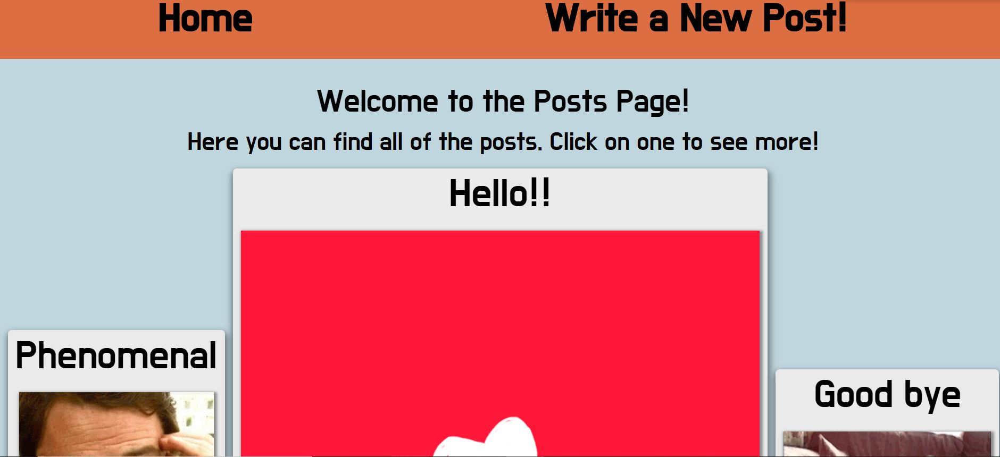
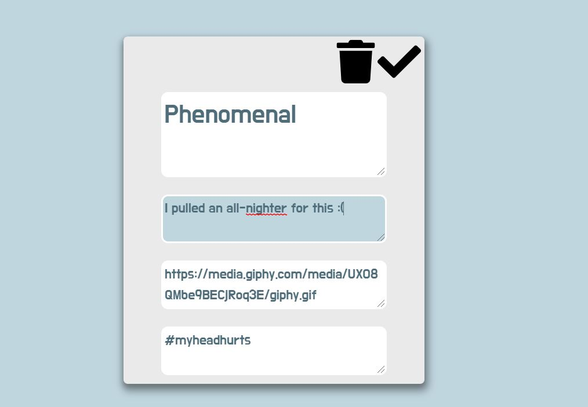
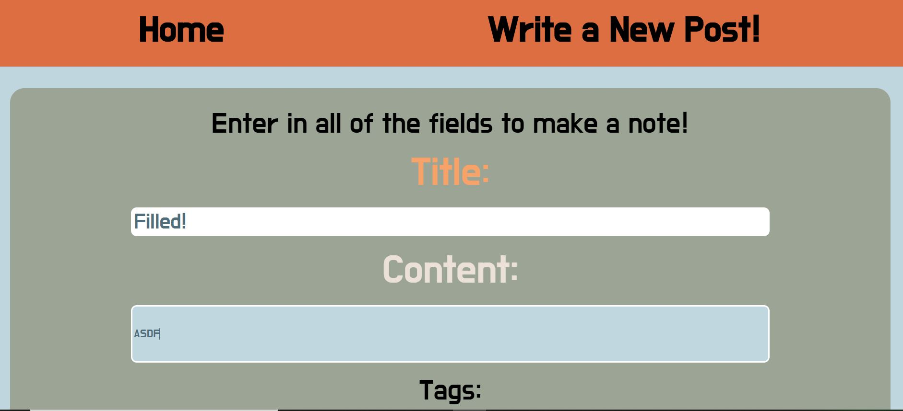

# Blog Platform Client

*Here is my Blog project for Lab 4 in CS52. It is a CRUD-based sharing platform that allows people to post blog posts that persist.*

[Blog Live Website](http://jordantsanz-cs52-blog.surge.sh/)

This website was created with a react-redux data flow, and now incorperates a back-end database using MongoDB and a server with express.js. This website features functionality such as creating and deleting posts, as well as editing posts. You can see the entire list of all posts, and click one to be routed to that specific post's page. Because it was built with react and redux, it is a real-time hot-refresh website. 

## Screenshots

